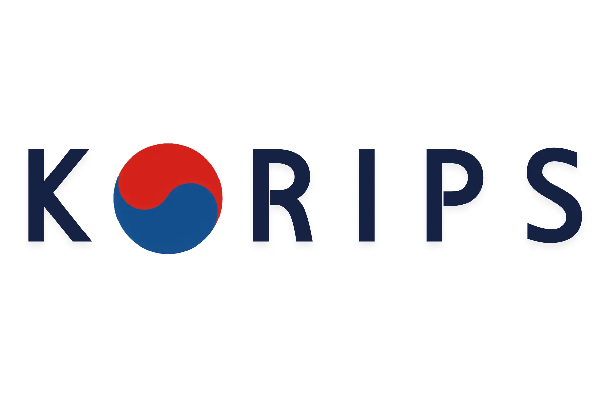

<p align="center">
  
</p>

# KORIPS 코립스(한국 온천 숙소/티켓 예약 서비스)

숙소 및 티켓 예매를 위한 웹 플랫폼입니다. 사용자는 이벤트를 확인하고, 숙소나 티켓을 예약하고, 후기를 남길 수 있습니다.

This is a web platform for booking accommodations and tickets. Users can check events, book lodges or tickets, and leave reviews.

---

## ✨ 주요 기능 (Key Features)

- **숙소 및 티켓 예매 (Lodge & Ticket Booking):** 사용자는 원하는 날짜에 숙소와 티켓을 검색하고 예약할 수 있습니다.
- **이벤트 및 뉴스 (Events & News):** 새로운 소식과 진행중인 이벤트를 확인할 수 있습니다.
- **사용자 인증 (User Authentication):** 이메일/비밀번호 및 Google OAuth를 통한 간편 로그인을 지원합니다.
- **결제 시스템 (Payment Integration):** 토스페이먼츠(Toss Payments)를 연동하여 안전하고 빠른 결제를 제공합니다.
- **리뷰 및 평점 (Reviews & Ratings):** 숙소와 티켓에 대한 사용자 후기를 작성하고 다른 사람의 후기를 확인할 수 있습니다.
- **다국어 지원 (Multilingual Support):** 한국어와 영어를 지원합니다.
- **위지윅 에디터 (Rich Text Editor):** Tiptap 에디터를 활용하여 콘텐츠를 편리하게 작성하고 관리할 수 있습니다.

## 🛠️ 기술 스택 (Tech Stack)

<p align="left">
  
  
  
  
  
  <br/>
  
  
  
  
  <br/>
  
  
  
</p>

## 🚀 시작하기 (Getting Started)

### 사전 요구 사항 (Prerequisites)

- Node.js (v20.x or later)
- npm, yarn, or pnpm

### 설치 (Installation)

1.  **저장소 복제 (Clone the repository):**
    ```bash
    git clone https://github.com/Raina-Moon/korip-web.git
    cd korip-web
    ```

2.  **의존성 설치 (Install dependencies):**
    ```bash
    npm install
    ```

3.  **환경 변수 설정 (Set up environment variables):**
    `.env.local` 파일을 생성하고 필요한 환경 변수를 추가합니다.
    ```env
    # .env.local
    NEXT_PUBLIC_API_URL=http://localhost:3000
    NEXT_PUBLIC_GOOGLE_CLIENT_ID=******
    NEXT_PUBLIC_TOSS_PAYMENTS_CLIENT_KEY=************
    ```

### 개발 서버 실행 (Running the Development Server)

아래 명령어를 실행하여 개발 서버를 시작합니다.

```bash
npm run dev
```

이제 브라우저에서 [http://localhost:3000](http://localhost:3000)으로 접속하여 결과를 확인할 수 있습니다.

## 📜 사용 가능한 스크립트 (Available Scripts)

-   `npm run dev`: 개발 모드로 애플리케이션을 실행합니다.
-   `npm run build`: 프로덕션용으로 애플리케이션을 빌드합니다.
-   `npm run start`: 프로덕션 빌드를 실행합니다.
-   `npm run lint`: ESLint를 사용하여 코드 스타일을 검사하고 수정합니다.

## 📁 프로젝트 구조 (Project Structure)

```
/
├── public/             # 정적 파일 (이미지, 폰트, 다국어 json)
├── src/
│   ├── app/            # Next.js App Router 페이지
│   ├── components/     # 공통 UI 컴포넌트
│   ├── hooks/          # 커스텀 훅
│   ├── lib/            # API 요청, 상태 관리 등 로직
│   ├── styles/         # 전역 스타일 및 SCSS 변수
│   └── types/          # TypeScript 타입 정의
├── .github/            # GitHub Actions 워크플로우
├── next.config.ts      # Next.js 설정
└── package.json        # 프로젝트 의존성 및 스크립트
```

## ☁️ 배포 (Deployment)

이 프로젝트는 다음 주소에 배포되었습니다:
The project is deployed at:
**[https://korips.com](https://korips.com)**

아래 테스트 계정으로 로그인하여 기능을 확인해볼 수 있습니다:
You can log in with the following test account to explore the features:
- **이메일 / Email:** `test@example.com`
- **비밀번호 / Password:** `1234`